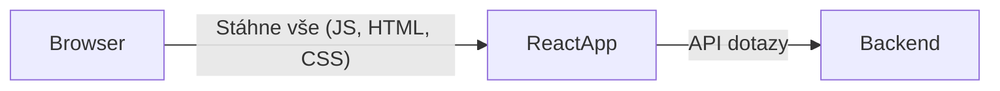
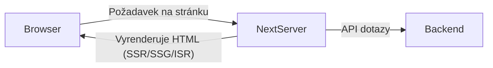

# Next.js: SSR, SSG, ISR – stručné vysvětlení

## Server Side Rendering (SSR)

**SSR** znamená, že stránka se renderuje na serveru při každém požadavku uživatele. Server vygeneruje HTML na základě aktuálních dat a odešle ho do prohlížeče.

- V Next.js použij funkci `getServerSideProps`.
- Vhodné, když potřebuješ vždy aktuální data (např. dashboard, profil uživatele).
- SEO friendly – vyhledávače dostanou hotové HTML.

```js
export async function getServerSideProps(context) {
  // Fetch data
  return { props: { data } }
}
```

---

## Static Site Generation (SSG)

**SSG** znamená, že stránka se vygeneruje do HTML během build procesu (tj. při nasazení aplikace), ne při každém požadavku. Výsledné HTML se uloží a servíruje uživatelům bez potřeby generování na serveru.

- V Next.js použij funkci `getStaticProps`.
- Výborné pro stránky, kde se data často nemění (např. blogové příspěvky, dokumentace).
- Rychlé načítání, skvělý výkon, nízké nároky na server.

```js
export async function getStaticProps(context) {
  // Fetch data
  return { props: { data } }
}
```

---

## Incremental Static Regeneration (ISR)

**ISR** je rozšíření SSG. Umožňuje znovu vygenerovat (aktualizovat) již staticky vygenerované stránky po určitém čase nebo na základě požadavku, aniž by bylo nutné znovu buildovat celou aplikaci.

- V Next.js použij také `getStaticProps`, ale přidej `revalidate`.
- Umožňuje kombinovat výhody statických stránek a aktualizovaných dat.
- Stránky se automaticky regenerují na pozadí, když uplyne interval `revalidate`.

```js
export async function getStaticProps(context) {
  // Fetch data
  return {
    props: { data },
    revalidate: 60, // stránka se obnoví max. každých 60 sekund
  }
}
```

---

## Shrnutí:

| Technika | Kdy se generuje HTML      | Výhoda                  | Vhodné použití                    |
|----------|--------------------------|-------------------------|-----------------------------------|
| SSR      | Při každém requestu      | Vždy aktuální data      | Dynamické stránky, personalizace  |
| SSG      | Při buildu               | Rychlost, levný provoz  | Blogy, dokumentace, statické stránky |
| ISR      | Při buildu + po čase     | Kombinace SSG a SSR     | Stránky, co se občas mění, ale mají být rychlé |

# Klíčové vlastnosti Next.js

1. **Server-side rendering (SSR)**
    - Možnost generovat stránky na serveru při každém požadavku.

2. **Static site generation (SSG)**
    - Generování statických stránek při buildu, vhodné pro rychlé a bezpečné weby.

3. **Incremental Static Regeneration (ISR)**
    - Obnova statických stránek po určitém čase bez nutnosti znovu buildovat celý web.

4. **API Routes**
    - Možnost vytvářet serverless API endpointy přímo ve stejném projektu.

5. **Routing založený na souborové struktuře**
    - Automatické generování rout na základě struktury složky `/pages` (nebo `/app` v nové architektuře).

6. **Podpora TypeScriptu**
    - Plná integrace s TypeScriptem bez složité konfigurace.

7. **Podpora CSS a CSS-in-JS**
    - Možnost používat globální i modulární CSS, stejně jako styled-components nebo emotion.

8. **Optimalizace obrázků (`next/image`)**
    - Automatická optimalizace a lazy loading obrázků.

9. **Built-in internationalization (i18n)**
    - Snadná správa vícejazyčných webů.

10. **Hot Reloading a Fast Refresh**
    - Okamžité zobrazení změn při vývoji bez ztráty stavu komponent.

11. **Podpora middlewarů**
    - Možnost psát middleware pro úpravu requestů a response.

12. **Deployment a hosting na Vercel**
    - Bezproblémové nasazení na platformu Vercel, ale Next.js lze nasadit i jinde (např. Netlify, AWS, vlastní server).

13. **Integrace s Reactem**
    - Next.js je postaven na Reactu a využívá jeho ekosystém.

14. **Podpora dynamických a parametrizovaných rout**
    - Generování stránek na základě dynamických parametrů v URL.

---
Pokud chceš některou z těchto vlastností rozvést, dej vědět!

# SPA vs. Fullstack Framework (React vs. Next.js)

## 1. Co je SPA (Single Page Application)?
- **SPA** je webová aplikace, která se načte jako jedna HTML stránka a následné navigace probíhají bez opětovného načtení stránky.
- Typickým příkladem je aplikace napsaná v čistém **Reactu** (např. vytvořená pomocí [Create React App](https://create-react-app.dev/)).

### Výhody SPA (React):
- **Rychlá uživatelská zkušenost:** Navigace mezi stránkami je okamžitá, protože se stránka nepřenačítá.
- **Jednodušší frontendová architektura:** Vše běží v prohlížeči, backend je často pouze API.
- **Dobrá pro komplexní interaktivní aplikace** (např. dashboardy).

### Nevýhody SPA:
- **SEO:** Vyhledávače nemusí dobře indexovat obsah, protože většina obsahu je generovaná až v prohlížeči.
- **Dlouhá doba prvního načtení:** Celá aplikace se musí stáhnout do prohlížeče hned na začátku.
- **Hůře řešitelná autentizace a ochrana citlivých dat.**

---

## 2. Co je Fullstack framework (např. Next.js)?
- **Fullstack framework** jako Next.js kombinuje frontend (React) a backend (serverové routy, SSR, SSG, API).
- Next.js umožňuje **server-side rendering (SSR)**, **static site generation (SSG)**, API endpoints atd.

### Výhody Next.js (Fullstack):
- **SEO:** Serverem generované (nebo staticky generované) stránky jsou snadno indexovatelné vyhledávači.
- **Rychlé načtení první stránky:** První obsah je vygenerován už na serveru.
- **Možnost backendových funkcí:** API routy, serverová logika, autentizace.
- **Flexibilita: SSR, SSG, ISR, CSR** – lze kombinovat různé strategie generování obsahu.
- **Lepší bezpečnost:** Citlivá logika zůstává na serveru.

### Nevýhody Next.js:
- **Složitější architektura:** Nutnost řešit jak serverovou, tak klientskou část.
- **Nasazování:** Vyžaduje hosting, který umí běžet Node.js server (nebo edge functions).
- **Občas vyšší komplexita vývoje** u malých projektů.

---

## 3. Ilustrační obrázky rozdělení

### SPA (React)



- Frontend (React app) běží celý v prohlížeči, komunikuje pouze s API.

---

### Fullstack (Next.js)



- Požadavek jde na server, který může stránku před-renderovat, případně poskytuje vlastní API.

---

## 4. Shrnutí hlavních rozdílů

| Vlastnost         | SPA (React)             | Fullstack (Next.js)          |
|-------------------|-------------------------|------------------------------|
| SEO               | Slabší                  | Výborné                      |
| První načtení     | Pomalejší               | Rychlejší                    |
| Navigace          | Okamžitá                | Okamžitá                     |
| Backend           | Potřebuješ zvlášť       | Součástí frameworku          |
| Nasazení          | Jednoduché (static host)| Složitější (server/edge)     |
| Komplexita        | Nižší                   | Vyšší                        |

---

Pokud chceš detailnější příklady nebo máš konkrétní dotaz, dej vědět!
